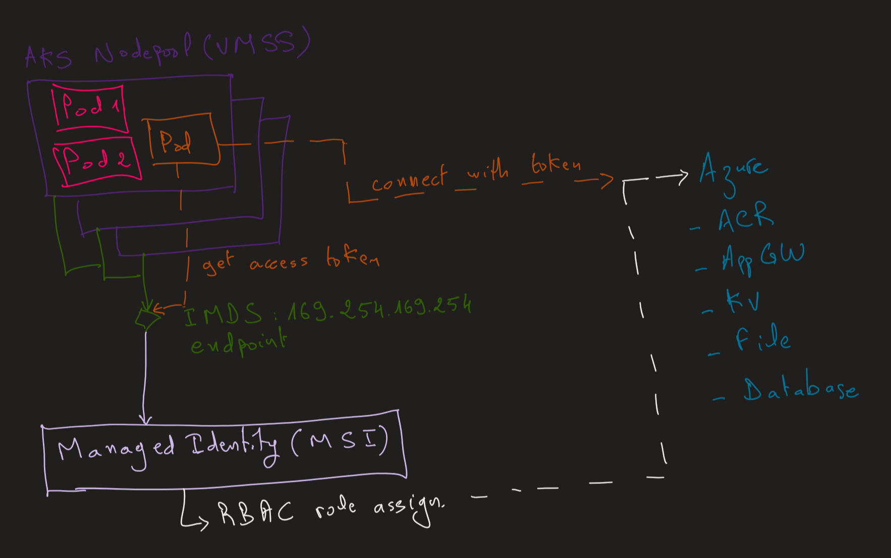
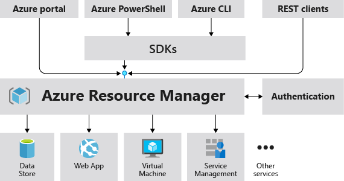
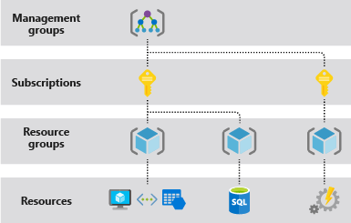

# Azure

## Managed Identity
Managed Identity in Azure is a feature of Azure Active Directory (Azure AD) that provides automatically managed identities for applications and services running on Azure. It eliminates the need for developers to manage credentials (like secrets, certificates, or keys) when connecting to resources that support Azure AD authentication.

### Types of Managed Identity
- System-assigned: Tied directly to an Azure resource (e.g., VM, Function App, App Service). When the resource is created, an identity can be enabled; if the resource is deleted, the identity is removed automatically.
- User-assigned: A standalone identity resource in Azure that can be assigned to one or more Azure resources. It persists independently of the resource lifecycle.

### How It Works
The Azure platform provisions an identity in Azure AD for the resource.
Applications running on that resource can request an OAuth 2.0 token from the Azure Instance Metadata Service (IMDS).
This token is then used to authenticate to Azure services (e.g., Azure Key Vault, Azure Storage, Azure SQL Database) without embedding credentials


### Benefits
Credential management is handled by Azure, reducing risks of leaked secrets.
Improved security: Identities are rotated automatically by Azure AD.
Seamless integration: Works natively with Azure services that support Azure AD authentication.


### Common Use Cases
- Accessing Azure Key Vault to retrieve secrets.
- Connecting to Azure Storage or Azure SQL Database.
- Running workloads on Azure Kubernetes Service (AKS) with pod-managed identities


managed identity is the capability that if i am an azure resource( eg virtual machine, kubernetes cluster etc), i just by virtue of being an azure resource, I can have something called a system managed identity
it belongs only to that resource and a process running within that resource

Entra would create the identity for the resource and processes within that resource can request tokens


## AKS Security: Deny access to IMDS metadata endpoint
The Azure Instance Metadata Service (IMDS) provides information about currently running virtual machine instances. You can use it to manage and configure your virtual machines. This information includes the SKU, storage, network configurations, and upcoming maintenance events.

IMDS is a REST API that's available at a well-known, non-routable IP address (169.254.169.254). You can only access it from within the VM. Communication between the VM and IMDS never leaves the host.

Kubelet has its own Managed Identity (MSI) attached to AKS. Kubelet uses IMDS endpoint to access the MSI and get an access token. These credentials can be accessed by the kubelet via the instance metadata service (IMDS). IMDS can be accessed via an HTTP request on a link-local IP address: 169.254.169.254. By `default, this metadata service is reachable to all pods on the nodes`.



[AKS Security: Deny access to IMDS metadata endpoint](https://github.com/HoussemDellai/aks-course/tree/main/54_deny_access_imds)


## Core Compute Resources
- Virtual Machines (VMs): Run workloads like applications, databases, or services.
- App Services: Platform-as-a-Service (PaaS) for hosting web apps and APIs without managing servers.
- Azure Kubernetes Service (AKS): Orchestrates containerized workloads.
- Azure Functions: Serverless compute triggered by events.
Connections:
VMs connect to storage for data, networking resources for access, and monitoring for visibility.
App Services often connect to databases, storage, and networking (like Application Gateway).
Functions can connect to Event Grid, Service Bus, or Logic Apps.

## Networking
- Virtual Network (VNet): Private network in Azure to connect resources.
- Subnets & Network Security Groups (NSGs): Segment traffic and control access.
- VPN Gateway / ExpressRoute: Connect Azure to on-premises networks.
- Azure Load Balancer / Application Gateway: Distribute traffic to resources.
- Azure Firewall / DDoS Protection: Security at the network edge.


## Storage & Databases
- Azure Storage (Blob, Queue, Table, File): Object, message, NoSQL, and file storage.
- Azure SQL Database / Managed Instance: Fully managed relational DB.
- Cosmos DB: Globally distributed NoSQL database.
- Azure Database for MySQL/Postgres: Managed open-source DBs.
- Azure Data Lake Storage: Optimized for big data analytics.

## Identity & Access
- Azure Active Directory (Entra ID): Identity and access management.
- Role-Based Access Control (RBAC): Grants permissions on resources.
- Managed Identities: Secure way for resources to authenticate without secrets.

## Monitoring & Management
- Azure Monitor / Log Analytics: Collect metrics and logs.
- Application Insights: Deep monitoring for applications.
- Azure Policy / Blueprints: Governance and compliance.
- Azure Resource Manager (ARM): Deployment and management framework.


## Security
- Key Vault: Store secrets, keys, and certificates.
- Microsoft Defender for Cloud: Threat detection and protection.
- Sentinel (SIEM): Security analytics across environments.

All Azure resources are tied together through:
- VNet & networking (connectivity),
- Azure AD (identity/security),
- Storage/Databases (data),
- Integration services (messaging/workflows),
Monitoring/Governance (visibility).


# What are ARM Templates?
An ARM template is a JSON file that defines the infrastructure and configuration for your Azure resources.
They are:
- Declarative: You describe what you want, not how to build it.
- Idempotent: Running the same template multiple times will result in the same final state.
- Automatable: Useful for CI/CD pipelines, repeatable deployments, and version control.
They work with Azure Resource Manager (ARM), the deployment and management service for Azure.

## Structure of an ARM Template
An ARM template is just JSON, but it has specific sections:
```json
{
  "$schema": "https://schema.management.azure.com/schemas/2019-04-01/deploymentTemplate.json#",
  "contentVersion": "1.0.0.0",
  "parameters": {},
  "variables": {},
  "functions": [],
  "resources": [],
  "outputs": {}
}
```

- $schema – Defines the template schema version.
- contentVersion – Your versioning number (helps track changes).
- parameters – Inputs you can pass in (e.g., location, VM size).
- variables – Reusable values (e.g., concatenated names).
- functions – Custom template functions.
- resources – The actual Azure resources (VMs, Storage Accounts, etc.).
- outputs – Values returned after deployment (like connection strings).

## Deployment Methods
You can deploy ARM templates in several ways:
Azure Portal (upload template in “Deploy a custom template”).
- Azure CLI:
`az deployment group create --resource-group MyRG --template-file azuredeploy.json`
- PowerShell:
`New-AzResourceGroupDeployment -ResourceGroupName MyRG -TemplateFile azuredeploy.json`
- DevOps Pipelines / GitHub Actions for automation.


### Virtual Networks and Subnets
A VNet defines an address space (e.g., 10.0.0.0/16).
Inside the VNet, you create subnets (e.g., 10.0.1.0/24).
Subnets are not independent resources — they’re defined inside the VNet resource JSON in your ARM template.
Example VNet + Subnet in ARM:
```json
{
  "type": "Microsoft.Network/virtualNetworks",
  "apiVersion": "2022-05-01",
  "name": "myVNet",
  "location": "[resourceGroup().location]",
  "properties": {
    "addressSpace": {
      "addressPrefixes": [
        "10.0.0.0/16"
      ]
    },
    "subnets": [
      {
        "name": "webSubnet",
        "properties": {
          "addressPrefix": "10.0.1.0/24"
        }
      },
      {
        "name": "dbSubnet",
        "properties": {
          "addressPrefix": "10.0.2.0/24"
        }
      }
    ]
  }
}
```
### How Resources Connect to Subnets
VMs don’t go directly into subnets.
Instead, you create a Network Interface (NIC) resource, and that NIC is assigned to a subnet.
Then you attach the NIC to the VM.
Example NIC referencing a subnet:
```json
{
  "type": "Microsoft.Network/networkInterfaces",
  "apiVersion": "2022-05-01",
  "name": "myNic",
  "location": "[resourceGroup().location]",
  "properties": {
    "ipConfigurations": [
      {
        "name": "ipconfig1",
        "properties": {
          "subnet": {
            "id": "[resourceId('Microsoft.Network/virtualNetworks/subnets', 'myVNet', 'webSubnet')]"
          },
          "privateIPAllocationMethod": "Dynamic"
        }
      }
    ]
  }
}
```

# Azure Resource Manager
An Azure Storage Account provides a namespace in Azure for storing data. Within it, you can use different storage services:
- Blob storage (for unstructured objects like images, backups, logs)
- File shares (SMB/NFS for lift-and-shift apps)
- Queues (message-based communication)
- Tables (NoSQL key-value storage)
- Disks (VM disks are backed by storage accounts in standard tiers)


Storage accounts often appear as dependencies (dependsOn) for VMs.
Resources reference them via their resource ID:
```json
{
  "type": "Microsoft.Storage/storageAccounts",
  "apiVersion": "2022-09-01",
  "name": "[variables('storageAccountName')]",
  "location": "[resourceGroup().location]",
  "sku": { "name": "Standard_LRS" },
  "kind": "StorageV2",
  "properties": {}
}
```

```json
{
  "$schema": "https://schema.management.azure.com/schemas/2019-04-01/deploymentTemplate.json#",
  "contentVersion": "1.0.0.0",
  "resources": [
    {
      "type": "Microsoft.Storage/storageAccounts",
      "apiVersion": "2022-09-01",
      "name": "[variables('storageAccountName')]",
      "location": "[resourceGroup().location]",
      "sku": {
        "name": "Standard_LRS"
      },
      "kind": "StorageV2",
      "properties": {}
    },
    {
      "type": "Microsoft.Compute/virtualMachines",
      "apiVersion": "2022-11-01",
      "name": "[variables('vmName')]",
      "location": "[resourceGroup().location]",
      "dependsOn": [
        "[resourceId('Microsoft.Storage/storageAccounts', variables('storageAccountName'))]"
      ],
      "properties": {
        "hardwareProfile": {
          "vmSize": "Standard_B2s"
        },
        "osProfile": {
          "computerName": "[variables('vmName')]",
          "adminUsername": "azureuser",
          "adminPassword": "P@ssw0rd1234!"
        },
        "storageProfile": {
          "osDisk": {
            "name": "[concat(variables('vmName'),'-osdisk')]",
            "caching": "ReadWrite",
            "createOption": "FromImage",
            "vhd": {
              "uri": "[concat('https://', variables('storageAccountName'), '.blob.core.windows.net/vhds/', variables('vmName'), '-osdisk.vhd')]"
            }
          },
          "imageReference": {
            "publisher": "MicrosoftWindowsServer",
            "offer": "WindowsServer",
            "sku": "2019-Datacenter",
            "version": "latest"
          }
        },
        "diagnosticsProfile": {
          "bootDiagnostics": {
            "enabled": true,
            "storageUri": "[concat('https://', variables('storageAccountName'), '.blob.core.windows.net/')]"
          }
        },
        "networkProfile": {
          "networkInterfaces": [
            {
              "id": "[resourceId('Microsoft.Network/networkInterfaces', variables('nicName'))]"
            }
          ]
        }
      }
    }
  ]
}
```

- Storage Account Definition:
Creates a StorageV2 account named via variables('`storageAccountName`').
- VM Resource Depends On Storage:
The "dependsOn" ensures the storage account is created before the VM.
- OS Disk Stored in Blob Storage:
The `osDisk.vhd.uri` points to the storage account’s Blob container (vhds/).
- Boot Diagnostics Stored in Storage:
The `diagnosticsProfile.bootDiagnostics.storageUri` also references the same storage account.

### ARM JSON (Managed Disks + managed boot diagnostics)
```json
{
  "$schema": "https://schema.management.azure.com/schemas/2019-04-01/deploymentTemplate.json#",
  "contentVersion": "1.0.0.0",
  "parameters": {
    "vmName": { "type": "string", "defaultValue": "md-vm" }
  },
  "resources": [
    {
      "type": "Microsoft.Compute/virtualMachines",
      "apiVersion": "2022-11-01",
      "name": "[parameters('vmName')]",
      "location": "[resourceGroup().location]",
      "properties": {
        "hardwareProfile": { "vmSize": "Standard_B2s" },
        "osProfile": {
          "computerName": "[parameters('vmName')]",
          "adminUsername": "azureuser",
          "adminPassword": "P@ssw0rd1234!"
        },
        "storageProfile": {
          "imageReference": {
            "publisher": "MicrosoftWindowsServer",
            "offer": "WindowsServer",
            "sku": "2019-Datacenter",
            "version": "latest"
          },
          "osDisk": {
            "createOption": "FromImage",
            "managedDisk": { "storageAccountType": "Premium_LRS" }
          },
          "dataDisks": [
            {
              "lun": 0,
              "diskSizeGB": 128,
              "createOption": "Empty",
              "managedDisk": { "storageAccountType": "Premium_LRS" }
            }
          ]
        },
        "networkProfile": {
          "networkInterfaces": [
            { "id": "[resourceId('Microsoft.Network/networkInterfaces', concat(parameters('vmName'),'nic'))]" }
          ]
        },
        "diagnosticsProfile": {
          "bootDiagnostics": {
            "enabled": true
            /* no storageUri => uses managed boot diagnostics */
          }
        }
      },
      "dependsOn": [
        "[resourceId('Microsoft.Network/networkInterfaces', concat(parameters('vmName'),'nic'))]"
      ]
    }
  ]
}
```

### ARM JSON — VM with System-Assigned MI (+ optional RBAC)
```json
{
  "$schema": "https://schema.management.azure.com/schemas/2019-04-01/deploymentTemplate.json#",
  "contentVersion": "1.0.0.0",
  "parameters": {
    "vmName": { "type": "string", "defaultValue": "md-vm" },
    "keyVaultId": { "type": "string", "defaultValue": "" }  // OPTIONAL: scope for RBAC
  },
  "resources": [
    {
      "type": "Microsoft.Compute/virtualMachines",
      "apiVersion": "2022-11-01",
      "name": "[parameters('vmName')]",
      "location": "[resourceGroup().location]",
      "identity": {
        "type": "SystemAssigned"
      },
      "properties": {
        "hardwareProfile": { "vmSize": "Standard_B2s" },
        "osProfile": {
          "computerName": "[parameters('vmName')]",
          "adminUsername": "azureuser",
          "adminPassword": "P@ssw0rd1234!"
        },
        "storageProfile": {
          "imageReference": {
            "publisher": "MicrosoftWindowsServer",
            "offer": "WindowsServer",
            "sku": "2019-Datacenter",
            "version": "latest"
          },
          "osDisk": {
            "createOption": "FromImage",
            "managedDisk": { "storageAccountType": "Premium_LRS" }
          }
        },
        "networkProfile": {
          "networkInterfaces": [
            { "id": "[resourceId('Microsoft.Network/networkInterfaces', concat(parameters('vmName'),'nic'))]" }
          ]
        },
        "diagnosticsProfile": { "bootDiagnostics": { "enabled": true } }
      }
    },

    // OPTIONAL: grant the VM's MI "Key Vault Secrets User" on a specific Key Vault
    {
      "condition": "[not(empty(parameters('keyVaultId')))]",
      "type": "Microsoft.Authorization/roleAssignments",
      "apiVersion": "2022-04-01",
      "name": "[guid(parameters('keyVaultId'), parameters('vmName'), 'kv-secrets-user')]",
      "scope": "[parameters('keyVaultId')]",
      "properties": {
        "roleDefinitionId": "[subscriptionResourceId('Microsoft.Authorization/roleDefinitions', '4633458b-17de-408a-b874-0445c86b69e6')]", 
        "principalId": "[reference(resourceId('Microsoft.Compute/virtualMachines', parameters('vmName')), '2022-11-01', 'Full').identity.principalId]"
      },
      "dependsOn": [
        "[resourceId('Microsoft.Compute/virtualMachines', parameters('vmName'))]"
      ]
    }
  ],
  "outputs": {
    "vmPrincipalId": {
      "type": "string",
      "value": "[reference(resourceId('Microsoft.Compute/virtualMachines', parameters('vmName')), '2022-11-01', 'Full').identity.principalId]"
    }
  }
}
```

## Resource Group First
Every resource (VM, App Service, Storage, etc.) must live in a resource group (RG).
The RG itself sits inside a subscription (and optionally under a management group if you use governance).
You create the RG either manually (Portal, CLI, PowerShell) or as part of your ARM deployment


Example (ARM JSON for RG):
```json
{
  "type": "Microsoft.Resources/resourceGroups",
  "apiVersion": "2021-04-01",
  "location": "eastus",
  "name": "app-prod-rg"
}
```
In practice, most people create RGs ahead of time (via CLI or IaC) and then deploy resources into them.

### ARM Deployment Scope
When you run an ARM template (or Bicep), you choose the deployment scope:
- Resource group–scoped deployment → most common
```sh
az deployment group create \
  --resource-group app-prod-rg \
  --template-file main.bicep
  ```
→ All resources in that template get created inside `app-prod-rg`.
- Subscription-scoped deployment → used to create RGs and put resources inside them in one go.
Example: create multiple RGs and deploy resources into each.


```sh
# Deploy at subscription scope
az deployment sub create \
  --location eastus \
  --template-file main.json \
  --parameters rgName=myapp-prod-rg rgLocation=eastus storageName=mystorageacct123
```


```sh
# Login & set subscription
az account set --subscription "<SUBSCRIPTION_ID>"

# Deploy at subscription scope
az deployment sub create \
  --location eastus \
  --template-file main.bicep \
  --parameters teamGroupObjectId='<AAD_OBJECT_ID_OF_TEAM_GROUP>' \
               rgName='lz-app-prod-rg' \
               rgLocation='eastus' \
               monthlyBudget=500
```

main-subscription.json (subscription-scope)
```json
{
  "$schema": "https://schema.management.azure.com/schemas/2019-08-01/subscriptionDeploymentTemplate.json#",
  "contentVersion": "1.0.0.0",
  "parameters": {
    "rgName": { "type": "string", "defaultValue": "lz-app-prod-rg" },
    "rgLocation": { "type": "string", "defaultValue": "eastus" },
    "teamGroupObjectId": {
      "type": "string",
      "metadata": { "description": "AAD objectId (GUID) of the team/security group to grant Contributor on the RG" }
    },
    "monthlyBudget": {
      "type": "int",
      "defaultValue": 0,
      "metadata": { "description": "USD budget scoped to this RG; 0 = skip creating a budget" }
    },
    "kvSku": { "type": "string", "defaultValue": "standard", "allowedValues": ["standard","premium"] },
    "vnetName": { "type": "string", "defaultValue": "vnet-hub-app-prod" },
    "vnetAddressSpace": { "type": "string", "defaultValue": "10.20.0.0/16" },
    "subnets": {
      "type": "array",
      "defaultValue": [
        { "name": "snet-app",     "prefix": "10.20.1.0/24" },
        { "name": "snet-data",    "prefix": "10.20.2.0/24" },
        { "name": "snet-private", "prefix": "10.20.3.0/24" }
      ]
    },
    "kvName": { "type": "string", "defaultValue": "[concat('kv-app-prod-', uniqueString(subscription().subscriptionId))]" },
    "laName": { "type": "string", "defaultValue": "log-app-prod" },
    "stgName": { "type": "string", "defaultValue": "[concat('stgapp', uniqueString(subscription().subscriptionId, 'lz'))]" }
  },
  "variables": {
    "roleContributor": "/providers/Microsoft.Authorization/roleDefinitions/b24988ac-6180-42a0-ab88-20f7382dd24c",
    "policyRequireTag": "/providers/Microsoft.Authorization/policyDefinitions/4e3e82a1-9b1f-4e3a-8f63-8b7af050bf21",
    "policyDenyKvPublic": "/providers/Microsoft.Authorization/policyDefinitions/1f1048eb-7f65-4f7e-b2d5-cd71b48c23b7",
    "policyDenyStgPublic": "/providers/Microsoft.Authorization/policyDefinitions/1f1d4d9c-159c-4b57-9f8b-c894e9b4f30f"
  },
  "resources": [
    {
      "type": "Microsoft.Resources/resourceGroups",
      "apiVersion": "2021-04-01",
      "name": "[parameters('rgName')]",
      "location": "[parameters('rgLocation')]",
      "properties": {}
    },
    {
      "type": "Microsoft.Authorization/roleAssignments",
      "apiVersion": "2022-04-01",
      "name": "[guid(subscription().subscriptionId, parameters('rgName'), 'contributor', parameters('teamGroupObjectId'))]",
      "scope": "[format('/subscriptions/{0}/resourceGroups/{1}', subscription().subscriptionId, parameters('rgName'))]",
      "dependsOn": [
        "[resourceId('Microsoft.Resources/resourceGroups', parameters('rgName'))]"
      ],
      "properties": {
        "roleDefinitionId": "[concat(subscriptionResourceId('', variables('roleContributor')))]",
        "principalId": "[parameters('teamGroupObjectId')]"
      }
    },
    {
      "type": "Microsoft.Authorization/policyAssignments",
      "apiVersion": "2022-06-01",
      "name": "require-tag-env",
      "scope": "[format('/subscriptions/{0}/resourceGroups/{1}', subscription().subscriptionId, parameters('rgName'))]",
      "dependsOn": [
        "[resourceId('Microsoft.Resources/resourceGroups', parameters('rgName'))]"
      ],
      "properties": {
        "displayName": "Require env tag",
        "policyDefinitionId": "[subscriptionResourceId('Microsoft.Authorization/policyDefinitions', split(variables('policyRequireTag'), '/')[4])]",
        "parameters": {
          "tagName": { "value": "env" },
          "tagValue": { "value": "prod" }
        },
        "enforcementMode": "Default"
      }
    },
    {
      "type": "Microsoft.Authorization/policyAssignments",
      "apiVersion": "2022-06-01",
      "name": "require-tag-owner",
      "scope": "[format('/subscriptions/{0}/resourceGroups/{1}', subscription().subscriptionId, parameters('rgName'))]",
      "dependsOn": [
        "[resourceId('Microsoft.Resources/resourceGroups', parameters('rgName'))]"
      ],
      "properties": {
        "displayName": "Require owner tag",
        "policyDefinitionId": "[subscriptionResourceId('Microsoft.Authorization/policyDefinitions', split(variables('policyRequireTag'), '/')[4])]",
        "parameters": {
          "tagName": { "value": "owner" },
          "tagValue": { "value": "platform-team" }
        },
        "enforcementMode": "Default"
      }
    },
    {
      "type": "Microsoft.Authorization/policyAssignments",
      "apiVersion": "2022-06-01",
      "name": "deny-kv-public-network",
      "scope": "[format('/subscriptions/{0}/resourceGroups/{1}', subscription().subscriptionId, parameters('rgName'))]",
      "dependsOn": [
        "[resourceId('Microsoft.Resources/resourceGroups', parameters('rgName'))]"
      ],
      "properties": {
        "displayName": "Deny Key Vault public network access",
        "policyDefinitionId": "[subscriptionResourceId('Microsoft.Authorization/policyDefinitions', split(variables('policyDenyKvPublic'), '/')[4])]",
        "enforcementMode": "Default"
      }
    },
    {
      "type": "Microsoft.Authorization/policyAssignments",
      "apiVersion": "2022-06-01",
      "name": "deny-storage-public-network",
      "scope": "[format('/subscriptions/{0}/resourceGroups/{1}', subscription().subscriptionId, parameters('rgName'))]",
      "dependsOn": [
        "[resourceId('Microsoft.Resources/resourceGroups', parameters('rgName'))]"
      ],
      "properties": {
        "displayName": "Deny Storage public network access",
        "policyDefinitionId": "[subscriptionResourceId('Microsoft.Authorization/policyDefinitions', split(variables('policyDenyStgPublic'), '/')[4])]",
        "enforcementMode": "Default"
      }
    },
    {
      "condition": "[greater(parameters('monthlyBudget'), 0)]",
      "type": "Microsoft.Consumption/budgets",
      "apiVersion": "2023-05-01",
      "name": "[concat('budget-', parameters('rgName'))]",
      "scope": "[format('/subscriptions/{0}', subscription().subscriptionId)]",
      "properties": {
        "category": "Cost",
        "amount": "[parameters('monthlyBudget')]",
        "timeGrain": "Monthly",
        "timePeriod": {
          "startDate": "[utcNow('u')]",
          "endDate": "[dateTimeAdd(utcNow('u'), 'P3Y')]"
        },
        "filters": {
          "resourceGroups": [ "[parameters('rgName')]" ]
        },
        "notifications": {
          "actual_GreaterThan_80": {
            "enabled": true,
            "operator": "GreaterThan",
            "threshold": 80,
            "contactEmails": [ "finops@example.com" ]
          }
        }
      }
    },
    {
      "type": "Microsoft.Resources/deployments",
      "apiVersion": "2021-04-01",
      "name": "rgCoreDeployment",
      "resourceGroup": "[parameters('rgName')]",
      "dependsOn": [
        "[resourceId('Microsoft.Resources/resourceGroups', parameters('rgName'))]"
      ],
      "properties": {
        "mode": "Incremental",
        "templateLink": {
          "uri": "<PUT-URL-TO-rg-core.json>", 
          "contentVersion": "1.0.0.0"
        },
        "parameters": {
          "vnetName": { "value": "[parameters('vnetName')]" },
          "vnetAddressSpace": { "value": "[parameters('vnetAddressSpace')]" },
          "subnets": { "value": "[parameters('subnets')]" },
          "kvName": { "value": "[parameters('kvName')]" },
          "laName": { "value": "[parameters('laName')]" },
          "stgName": { "value": "[parameters('stgName')]" },
          "kvSku": { "value": "[parameters('kvSku')]" }
        }
      }
    }
  ],
  "outputs": {
    "resourceGroupId": {
      "type": "string",
      "value": "[format('/subscriptions/{0}/resourceGroups/{1}', subscription().subscriptionId, parameters('rgName'))]"
    }
  }
}
```

f you don’t want to host `rg-core.json`, you can inline it by replacing t`emplateLink` with an embedded `template` object

rg-core.json (resource-group-scope)

```json
{
  "$schema": "https://schema.management.azure.com/schemas/2019-04-01/deploymentTemplate.json#",
  "contentVersion": "1.0.0.0",
  "parameters": {
    "vnetName": { "type": "string" },
    "vnetAddressSpace": { "type": "string" },
    "subnets": { "type": "array" },
    "kvName": { "type": "string" },
    "laName": { "type": "string" },
    "stgName": { "type": "string" },
    "kvSku": { "type": "string", "defaultValue": "standard", "allowedValues": ["standard","premium"] }
  },
  "resources": [
    {
      "type": "Microsoft.Network/virtualNetworks",
      "apiVersion": "2023-05-01",
      "name": "[parameters('vnetName')]",
      "location": "[resourceGroup().location]",
      "properties": {
        "addressSpace": { "addressPrefixes": [ "[parameters('vnetAddressSpace')]" ] },
        "subnets": [
          {
            "copy": {
              "name": "subnetLoop",
              "count": "[length(parameters('subnets'))]"
            },
            "name": "[parameters('subnets')[copyIndex('subnetLoop')].name]",
            "properties": {
              "addressPrefix": "[parameters('subnets')[copyIndex('subnetLoop')].prefix]",
              "privateEndpointNetworkPolicies": "Disabled"
            }
          }
        ]
      }
    },
    {
      "type": "Microsoft.Storage/storageAccounts",
      "apiVersion": "2023-01-01",
      "name": "[parameters('stgName')]",
      "location": "[resourceGroup().location]",
      "sku": { "name": "Standard_LRS" },
      "kind": "StorageV2",
      "properties": {
        "minimumTlsVersion": "TLS1_2",
        "allowBlobPublicAccess": false,
        "networkAcls": {
          "defaultAction": "Deny",
          "bypass": "AzureServices"
        },
        "encryption": {
          "keySource": "Microsoft.Storage",
          "services": {
            "blob": { "enabled": true },
            "file": { "enabled": true }
          }
        }
      }
    },
    {
      "type": "Microsoft.OperationalInsights/workspaces",
      "apiVersion": "2022-10-01",
      "name": "[parameters('laName')]",
      "location": "[resourceGroup().location]",
      "properties": {
        "sku": { "name": "PerGB2018" },
        "retentionInDays": 30,
        "features": { "enableLogAccessUsingOnlyResourcePermissions": true }
      }
    },
    {
      "type": "Microsoft.KeyVault/vaults",
      "apiVersion": "2023-07-01",
      "name": "[parameters('kvName')]",
      "location": "[resourceGroup().location]",
      "properties": {
        "tenantId": "[subscription().tenantId]",
        "enableRbacAuthorization": true,
        "enablePurgeProtection": true,
        "softDeleteRetentionInDays": 90,
        "sku": { "family": "A", "name": "[toLower(parameters('kvSku'))]" },
        "publicNetworkAccess": "Disabled",
        "networkAcls": {
          "defaultAction": "Deny",
          "bypass": "AzureServices"
        }
      }
    }
  ],
  "outputs": {
    "vnetId": { "type": "string", "value": "[resourceId('Microsoft.Network/virtualNetworks', parameters('vnetName'))]" },
    "kvName": { "type": "string", "value": "[parameters('kvName')]" },
    "laId": { "type": "string", "value": "[resourceId('Microsoft.OperationalInsights/workspaces', parameters('laName'))]" },
    "stgId": { "type": "string", "value": "[resourceId('Microsoft.Storage/storageAccounts', parameters('stgName'))]" }
  }
}
```

What a Subscription Is
- An Azure subscription is essentially a billing and management boundary for your Azure resources.
It ties usage (VM hours, storage consumed, data transfer, etc.) to a billing account (credit card, enterprise agreement, CSP, etc.).
- Every resource you deploy (VM, Storage, App Service, etc.) must live in one subscription.


When you declare an Application Gateway in ARM, you typically need:
- Frontend IP configuration: Public IP or VNet IP
- Listeners: Define how requests come in (ports, host headers, protocol)
- Rules: Routing rules (basic or path-based)
- Backend pools: The app servers or services to forward requests to
- Backend HTTP settings: How AGW talks to backends (protocol, port, cookie affinity)
- Probes (optional): Health checks

`applicationgatewaytemplate.json`

```json
{
  "$schema": "https://schema.management.azure.com/schemas/2019-04-01/deploymentTemplate.json#",
  "contentVersion": "1.0.0.0",
  "parameters": {
    "location": {
      "type": "string",
      "defaultValue": "[resourceGroup().location]"
    },
    "applicationGatewayName": {
      "type": "string",
      "defaultValue": "myAppGateway"
    },
    "publicIpName": {
      "type": "string",
      "defaultValue": "myAppGwPublicIp"
    }
  },
  "resources": [
    {
      "type": "Microsoft.Network/publicIPAddresses",
      "apiVersion": "2023-11-01",
      "name": "[parameters('publicIpName')]",
      "location": "[parameters('location')]",
      "sku": { "name": "Standard" },
      "properties": {
        "publicIPAllocationMethod": "Static",
        "dnsSettings": {
          "domainNameLabel": "myappgatewaydemo123"
        }
      }
    },
    {
      "type": "Microsoft.Network/applicationGateways",
      "apiVersion": "2023-11-01",
      "name": "[parameters('applicationGatewayName')]",
      "location": "[parameters('location')]",
      "sku": {
        "name": "Standard_v2",
        "tier": "Standard_v2",
        "capacity": 2
      },
      "properties": {
        "frontendIPConfigurations": [
          {
            "name": "appGwFrontendIP",
            "properties": {
              "publicIPAddress": {
                "id": "[resourceId('Microsoft.Network/publicIPAddresses', parameters('publicIpName'))]"
              }
            }
          }
        ],
        "frontendPorts": [
          {
            "name": "port80",
            "properties": { "port": 80 }
          }
        ],
        "backendAddressPools": [
          {
            "name": "backendPool1",
            "properties": {
              "backendAddresses": [
                { "ipAddress": "10.0.1.4" },
                { "ipAddress": "10.0.1.5" }
              ]
            }
          }
        ],
        "backendHttpSettingsCollection": [
          {
            "name": "httpSetting1",
            "properties": {
              "port": 80,
              "protocol": "Http",
              "cookieBasedAffinity": "Disabled",
              "pickHostNameFromBackendAddress": false,
              "requestTimeout": 20
            }
          }
        ],
        "httpListeners": [
          {
            "name": "listener1",
            "properties": {
              "frontendIPConfiguration": {
                "id": "[concat(resourceId('Microsoft.Network/applicationGateways', parameters('applicationGatewayName')), '/frontendIPConfigurations/appGwFrontendIP')]"
              },
              "frontendPort": {
                "id": "[concat(resourceId('Microsoft.Network/applicationGateways', parameters('applicationGatewayName')), '/frontendPorts/port80')]"
              },
              "protocol": "Http"
            }
          }
        ],
        "requestRoutingRules": [
          {
            "name": "rule1",
            "properties": {
              "ruleType": "Basic",
              "httpListener": {
                "id": "[concat(resourceId('Microsoft.Network/applicationGateways', parameters('applicationGatewayName')), '/httpListeners/listener1')]"
              },
              "backendAddressPool": {
                "id": "[concat(resourceId('Microsoft.Network/applicationGateways', parameters('applicationGatewayName')), '/backendAddressPools/backendPool1')]"
              },
              "backendHttpSettings": {
                "id": "[concat(resourceId('Microsoft.Network/applicationGateways', parameters('applicationGatewayName')), '/backendHttpSettingsCollection/httpSetting1')]"
              }
            }
          }
        ]
      }
    }
  ],
  "outputs": {
    "appGatewayFqdn": {
      "type": "string",
      "value": "[reference(parameters('publicIpName')).dnsSettings.fqdn]"
    }
  }
}
```

- Creates a Public IP with a DNS name (e.g., myappgatewaydemo123.eastus.cloudapp.azure.com)
- Creates an Application Gateway (Standard_v2)
- Listens on port 80
- Routes traffic to two backend servers (10.0.1.4 and 10.0.1.5)
- Outputs the AGW’s FQDN so you can test it


`azuredeploy.json`

```json
{
  "$schema": "https://schema.management.azure.com/schemas/2019-04-01/deploymentTemplate.json#",
  "contentVersion": "1.0.0.0",
  "parameters": {
    "location": {
      "type": "string",
      "defaultValue": "[resourceGroup().location]"
    },
    "appGatewayName": {
      "type": "string",
      "defaultValue": "agw-wafv2"
    },
    "publicIpName": {
      "type": "string",
      "defaultValue": "agw-pip"
    },
    "vnetName": {
      "type": "string",
      "defaultValue": "agw-vnet"
    },
    "agwSubnetCidr": {
      "type": "string",
      "defaultValue": "10.0.0.0/24",
      "metadata": { "description": "Dedicated subnet for Application Gateway" }
    },
    "backendSubnetCidr": {
      "type": "string",
      "defaultValue": "10.0.1.0/24"
    },
    "dnsLabelPrefix": {
      "type": "string",
      "defaultValue": "agw-demo-unique"
    },
    "keyVaultCertSecretId": {
      "type": "string",
      "metadata": {
        "description": "Full Secret ID URL for your certificate in Key Vault (versioned or latest). Example: https://<kv>.vault.azure.net/secrets/<cert-name>/<version>"
      }
    },
    "webBackendFqdn": {
      "type": "string",
      "defaultValue": "mywebapp.azurewebsites.net",
      "metadata": { "description": "Frontend website (default) served at /" }
    },
    "apiBackendTargets": {
      "type": "array",
      "defaultValue": [
        { "ipAddress": "10.0.1.4" },
        { "ipAddress": "10.0.1.5" }
      ],
      "metadata": { "description": "API backend pool (IPs or FQDNs). Example item: {\"fqdn\":\"api.contoso.com\"} or {\"ipAddress\":\"10.0.1.4\"}" }
    },
    "apiBackendPort": {
      "type": "int",
      "defaultValue": 8080
    },
    "autoscaleMin": {
      "type": "int",
      "defaultValue": 1
    },
    "autoscaleMax": {
      "type": "int",
      "defaultValue": 5
    }
  },
  "variables": {
    "agwSubnetName": "appGatewaySubnet",
    "backendSubnetName": "appBackendSubnet",
    "frontendIpName": "appGw-frontend-ip",
    "frontendPort80": "port80",
    "frontendPort443": "port443",
    "listenerHttp": "listener-http",
    "listenerHttps": "listener-https",
    "redirectToHttps": "redirect-http-to-https",
    "urlPathMap": "urlpathmap-default",
    "ruleHttp": "rule-http-redirect",
    "ruleHttps": "rule-https-pathbased",
    "backendPoolWeb": "pool-web",
    "backendPoolApi": "pool-api",
    "httpSettingsWeb": "bhs-web-80",
    "httpSettingsApi": "bhs-api",
    "probeWeb": "probe-web",
    "probeApi": "probe-api",
    "sslCertName": "tls-cert",
    "gatewayIpConfigName": "appGwIpConfig"
  },
  "resources": [
    {
      "type": "Microsoft.Network/publicIPAddresses",
      "apiVersion": "2023-11-01",
      "name": "[parameters('publicIpName')]",
      "location": "[parameters('location')]",
      "sku": { "name": "Standard" },
      "properties": {
        "publicIPAllocationMethod": "Static",
        "dnsSettings": { "domainNameLabel": "[parameters('dnsLabelPrefix')]" }
      }
    },
    {
      "type": "Microsoft.Network/virtualNetworks",
      "apiVersion": "2023-11-01",
      "name": "[parameters('vnetName')]",
      "location": "[parameters('location')]",
      "properties": {
        "addressSpace": { "addressPrefixes": [ "10.0.0.0/16" ] },
        "subnets": [
          {
            "name": "[variables('agwSubnetName')]",
            "properties": { "addressPrefix": "[parameters('agwSubnetCidr')]" }
          },
          {
            "name": "[variables('backendSubnetName')]",
            "properties": { "addressPrefix": "[parameters('backendSubnetCidr')]" }
          }
        ]
      }
    },
    {
      "type": "Microsoft.Network/applicationGateways",
      "apiVersion": "2023-11-01",
      "name": "[parameters('appGatewayName')]",
      "location": "[parameters('location')]",
      "identity": { "type": "SystemAssigned" },
      "sku": {
        "name": "WAF_v2",
        "tier": "WAF_v2"
      },
      "properties": {
        "enableHttp2": true,
        "autoscaleConfiguration": {
          "minCapacity": "[parameters('autoscaleMin')]",
          "maxCapacity": "[parameters('autoscaleMax')]"
        },
        "gatewayIPConfigurations": [
          {
            "name": "[variables('gatewayIpConfigName')]",
            "properties": {
              "subnet": {
                "id": "[resourceId('Microsoft.Network/virtualNetworks/subnets', parameters('vnetName'), variables('agwSubnetName'))]"
              }
            }
          }
        ],
        "sslCertificates": [
          {
            "name": "[variables('sslCertName')]",
            "properties": {
              "keyVaultSecretId": "[parameters('keyVaultCertSecretId')]"
            }
          }
        ],
        "frontendIPConfigurations": [
          {
            "name": "[variables('frontendIpName')]",
            "properties": {
              "publicIPAddress": {
                "id": "[resourceId('Microsoft.Network/publicIPAddresses', parameters('publicIpName'))]"
              }
            }
          }
        ],
        "frontendPorts": [
          { "name": "[variables('frontendPort80')]", "properties": { "port": 80 } },
          { "name": "[variables('frontendPort443')]", "properties": { "port": 443 } }
        ],
        "backendAddressPools": [
          {
            "name": "[variables('backendPoolWeb')]",
            "properties": {
              "backendAddresses": [
                { "fqdn": "[parameters('webBackendFqdn')]" }
              ]
            }
          },
          {
            "name": "[variables('backendPoolApi')]",
            "properties": {
              "backendAddresses": "[parameters('apiBackendTargets')]"
            }
          }
        ],
        "probes": [
          {
            "name": "[variables('probeWeb')]",
            "properties": {
              "protocol": "Http",
              "path": "/",
              "pickHostNameFromBackendHttpSettings": true,
              "interval": 30,
              "timeout": 30,
              "unhealthyThreshold": 3,
              "match": { "statusCodes": [ "200-399" ] }
            }
          },
          {
            "name": "[variables('probeApi')]",
            "properties": {
              "protocol": "Http",
              "path": "/health",
              "interval": 30,
              "timeout": 30,
              "unhealthyThreshold": 3,
              "match": { "statusCodes": [ "200-399" ] }
            }
          }
        ],
        "backendHttpSettingsCollection": [
          {
            "name": "[variables('httpSettingsWeb')]",
            "properties": {
              "port": 80,
              "protocol": "Http",
              "cookieBasedAffinity": "Disabled",
              "pickHostNameFromBackendAddress": true,
              "requestTimeout": 30,
              "probe": {
                "id": "[concat(resourceId('Microsoft.Network/applicationGateways', parameters('appGatewayName')), '/probes/', variables('probeWeb'))]"
              }
            }
          },
          {
            "name": "[variables('httpSettingsApi')]",
            "properties": {
              "port": "[parameters('apiBackendPort')]",
              "protocol": "Http",
              "cookieBasedAffinity": "Disabled",
              "requestTimeout": 30,
              "probe": {
                "id": "[concat(resourceId('Microsoft.Network/applicationGateways', parameters('appGatewayName')), '/probes/', variables('probeApi'))]"
              }
            }
          }
        ],
        "httpListeners": [
          {
            "name": "[variables('listenerHttp')]",
            "properties": {
              "frontendIPConfiguration": {
                "id": "[concat(resourceId('Microsoft.Network/applicationGateways', parameters('appGatewayName')), '/frontendIPConfigurations/', variables('frontendIpName'))]"
              },
              "frontendPort": {
                "id": "[concat(resourceId('Microsoft.Network/applicationGateways', parameters('appGatewayName')), '/frontendPorts/', variables('frontendPort80'))]"
              },
              "protocol": "Http"
            }
          },
          {
            "name": "[variables('listenerHttps')]",
            "properties": {
              "frontendIPConfiguration": {
                "id": "[concat(resourceId('Microsoft.Network/applicationGateways', parameters('appGatewayName')), '/frontendIPConfigurations/', variables('frontendIpName'))]"
              },
              "frontendPort": {
                "id": "[concat(resourceId('Microsoft.Network/applicationGateways', parameters('appGatewayName')), '/frontendPorts/', variables('frontendPort443'))]"
              },
              "protocol": "Https",
              "sslCertificate": {
                "id": "[concat(resourceId('Microsoft.Network/applicationGateways', parameters('appGatewayName')), '/sslCertificates/', variables('sslCertName'))]"
              }
            }
          }
        ],
        "redirectConfigurations": [
          {
            "name": "[variables('redirectToHttps')]",
            "properties": {
              "redirectType": "Permanent",
              "targetListener": {
                "id": "[concat(resourceId('Microsoft.Network/applicationGateways', parameters('appGatewayName')), '/httpListeners/', variables('listenerHttps'))]"
              },
              "includePath": true,
              "includeQueryString": true
            }
          }
        ],
        "urlPathMaps": [
          {
            "name": "[variables('urlPathMap')]",
            "properties": {
              "defaultBackendAddressPool": {
                "id": "[concat(resourceId('Microsoft.Network/applicationGateways', parameters('appGatewayName')), '/backendAddressPools/', variables('backendPoolWeb'))]"
              },
              "defaultBackendHttpSettings": {
                "id": "[concat(resourceId('Microsoft.Network/applicationGateways', parameters('appGatewayName')), '/backendHttpSettingsCollection/', variables('httpSettingsWeb'))]"
              },
              "pathRules": [
                {
                  "name": "api-rule",
                  "properties": {
                    "paths": [ "/api/*" ],
                    "backendAddressPool": {
                      "id": "[concat(resourceId('Microsoft.Network/applicationGateways', parameters('appGatewayName')), '/backendAddressPools/', variables('backendPoolApi'))]"
                    },
                    "backendHttpSettings": {
                      "id": "[concat(resourceId('Microsoft.Network/applicationGateways', parameters('appGatewayName')), '/backendHttpSettingsCollection/', variables('httpSettingsApi'))]"
                    }
                  }
                }
              ]
            }
          }
        ],
        "requestRoutingRules": [
          {
            "name": "[variables('ruleHttp')]",
            "properties": {
              "ruleType": "Basic",
              "httpListener": {
                "id": "[concat(resourceId('Microsoft.Network/applicationGateways', parameters('appGatewayName')), '/httpListeners/', variables('listenerHttp'))]"
              },
              "redirectConfiguration": {
                "id": "[concat(resourceId('Microsoft.Network/applicationGateways', parameters('appGatewayName')), '/redirectConfigurations/', variables('redirectToHttps'))]"
              }
            }
          },
          {
            "name": "[variables('ruleHttps')]",
            "properties": {
              "ruleType": "PathBasedRouting",
              "httpListener": {
                "id": "[concat(resourceId('Microsoft.Network/applicationGateways', parameters('appGatewayName')), '/httpListeners/', variables('listenerHttps'))]"
              },
              "urlPathMap": {
                "id": "[concat(resourceId('Microsoft.Network/applicationGateways', parameters('appGatewayName')), '/urlPathMaps/', variables('urlPathMap'))]"
              }
            }
          }
        ],
        "webApplicationFirewallConfiguration": {
          "enabled": true,
          "firewallMode": "Prevention",
          "ruleSetType": "OWASP",
          "ruleSetVersion": "3.2",
          "requestBodyCheck": true
        }
      }
    }
  ],
  "outputs": {
    "gatewayPublicIp": {
      "type": "string",
      "value": "[reference(parameters('publicIpName')).ipAddress]"
    },
    "gatewayFqdn": {
      "type": "string",
      "value": "[reference(parameters('publicIpName')).dnsSettings.fqdn]"
    },
    "httpsUrl": {
      "type": "string",
      "value": "[format('https://{0}', reference(parameters('publicIpName')).dnsSettings.fqdn)]"
    }
  }
}
```

```json
{
  "$schema": "https://schema.management.azure.com/schemas/2019-04-01/deploymentParameters.json#",
  "contentVersion": "1.0.0.0",
  "parameters": {
    "dnsLabelPrefix": { "value": "agw-demo-unique-123" },
    "keyVaultCertSecretId": { "value": "https://<your-kv>.vault.azure.net/secrets/<your-cert>/<version>" },
    "webBackendFqdn": { "value": "mywebapp.azurewebsites.net" },
    "apiBackendTargets": {
      "value": [
        { "ipAddress": "10.0.1.4" },
        { "ipAddress": "10.0.1.5" }
      ]
    },
    "apiBackendPort": { "value": 8080 }
  }
}
```

```sh
# 1) Resource group
az group create -n rg-agw -l eastus

# 2) Preview
az deployment group what-if \
  --resource-group rg-agw \
  --template-file azuredeploy.json \
  --parameters @azuredeploy.parameters.json

# 3) Deploy
az deployment group create \
  --resource-group rg-agw \
  --template-file azuredeploy.json \
  --parameters @azuredeploy.parameters.json
```

- `Dedicated subnet`: Application Gateway must sit in its own subnet (appGatewaySubnet). Don’t place anything else there.
- `Key Vault access`: Because we use keyVaultSecretId + system-assigned identity, grant the gateway’s identity permission to read the cert:
   - `RBAC`: assign Key Vault Secrets User role on the secret (or KV) to the AGW’s managed identity principal.
   - Or (older) Access Policy: give Get secret permission to the AGW principal.
- `Backends`:
  - Web backend uses FQDN with pickHostNameFromBackendAddress=true so Host headers are correct (important for App Service).
  - API backend uses IPs + a custom port (8080). Swap to FQDNs by replacing items with { "fqdn": "api.contoso.com" }.
- HTTP→HTTPS permanent redirect is wired via a dedicated redirectConfiguration and an HTTP listener/rule.
- WAF is enabled in Prevention mode with OWASP 3.2. Tweak as needed (you can also attach a separate WAF Policy resource if you want custom rules/exclusions).
- Autoscale: minCapacity/maxCapacity control scale range. Remove capacity when using autoscale (already handled).


`FQDN = Fully Qualified Domain Name`

an Application Gateway (WAF_v2 + HTTPS) template tailored for two backends:
- App Service (FQDN backend; default route` /`)
- AKS Ingress (via the NGINX/AGIC ingress Service private IPs; path `/api/*`)
It does: HTTPS listener + HTTP→HTTPS redirect, autoscale, health probes, path-based routing, correct Host headers for both backends.
azuredeploy.json

```json
{
  "$schema": "https://schema.management.azure.com/schemas/2019-04-01/deploymentTemplate.json#",
  "contentVersion": "1.0.0.0",
  "parameters": {
    "location": { "type": "string", "defaultValue": "[resourceGroup().location]" },
    "appGatewayName": { "type": "string", "defaultValue": "agw-wafv2" },
    "publicIpName": { "type": "string", "defaultValue": "agw-pip" },
    "vnetName": { "type": "string", "defaultValue": "agw-vnet" },
    "agwSubnetCidr": { "type": "string", "defaultValue": "10.0.0.0/24" },
    "backendSubnetCidr": { "type": "string", "defaultValue": "10.0.1.0/24" },

    "dnsLabelPrefix": { "type": "string", "defaultValue": "agw-demo-unique" },

    "keyVaultCertSecretId": {
      "type": "string",
      "metadata": {
        "description": "Key Vault secret ID (versioned) for the TLS cert bound to the HTTPS listener."
      }
    },

    "appServiceDefaultHostName": {
      "type": "string",
      "metadata": { "description": "e.g., mywebapp.azurewebsites.net (no https://)" }
    },

    "aksIngressIps": {
      "type": "array",
      "metadata": { "description": "Private IP(s) of the AKS ingress Service (type=LoadBalancer or internal)." },
      "defaultValue": [
        { "ipAddress": "10.0.1.100" }
      ]
    },
    "aksBackendPort": { "type": "int", "defaultValue": 80 },

    "apiHostHeader": {
      "type": "string",
      "defaultValue": "api.contoso.com",
      "metadata": {
        "description": "Host header your AKS Ingress expects (matches your Ingress resource)."
      }
    },

    "autoscaleMin": { "type": "int", "defaultValue": 1 },
    "autoscaleMax": { "type": "int", "defaultValue": 5 }
  },

  "variables": {
    "agwSubnetName": "appGatewaySubnet",
    "backendSubnetName": "appBackendSubnet",
    "frontendIpName": "appGw-frontend-ip",
    "frontendPort80": "port80",
    "frontendPort443": "port443",
    "listenerHttp": "listener-http",
    "listenerHttps": "listener-https",
    "redirectToHttps": "redirect-http-to-https",
    "urlPathMap": "urlpathmap-default",
    "ruleHttp": "rule-http-redirect",
    "ruleHttps": "rule-https-pathbased",

    "poolAppSvc": "pool-appsvc",
    "poolAks": "pool-aks",
    "bhsAppSvc": "bhs-appsvc-http",
    "bhsAks": "bhs-aks-http",
    "probeAppSvc": "probe-appsvc",
    "probeAks": "probe-aks",

    "sslCertName": "tls-cert",
    "gatewayIpConfigName": "appGwIpConfig"
  },

  "resources": [
    {
      "type": "Microsoft.Network/publicIPAddresses",
      "apiVersion": "2023-11-01",
      "name": "[parameters('publicIpName')]",
      "location": "[parameters('location')]",
      "sku": { "name": "Standard" },
      "properties": {
        "publicIPAllocationMethod": "Static",
        "dnsSettings": { "domainNameLabel": "[parameters('dnsLabelPrefix')]" }
      }
    },
    {
      "type": "Microsoft.Network/virtualNetworks",
      "apiVersion": "2023-11-01",
      "name": "[parameters('vnetName')]",
      "location": "[parameters('location')]",
      "properties": {
        "addressSpace": { "addressPrefixes": [ "10.0.0.0/16" ] },
        "subnets": [
          { "name": "[variables('agwSubnetName')]", "properties": { "addressPrefix": "[parameters('agwSubnetCidr')]" } },
          { "name": "[variables('backendSubnetName')]", "properties": { "addressPrefix": "[parameters('backendSubnetCidr')]" } }
        ]
      }
    },
    {
      "type": "Microsoft.Network/applicationGateways",
      "apiVersion": "2023-11-01",
      "name": "[parameters('appGatewayName')]",
      "location": "[parameters('location')]",
      "identity": { "type": "SystemAssigned" },
      "sku": { "name": "WAF_v2", "tier": "WAF_v2" },
      "properties": {
        "enableHttp2": true,
        "autoscaleConfiguration": { "minCapacity": "[parameters('autoscaleMin')]", "maxCapacity": "[parameters('autoscaleMax')]" },

        "gatewayIPConfigurations": [
          {
            "name": "[variables('gatewayIpConfigName')]",
            "properties": {
              "subnet": { "id": "[resourceId('Microsoft.Network/virtualNetworks/subnets', parameters('vnetName'), variables('agwSubnetName'))]" }
            }
          }
        ],

        "sslCertificates": [
          { "name": "[variables('sslCertName')]", "properties": { "keyVaultSecretId": "[parameters('keyVaultCertSecretId')]" } }
        ],

        "frontendIPConfigurations": [
          { "name": "[variables('frontendIpName')]", "properties": { "publicIPAddress": { "id": "[resourceId('Microsoft.Network/publicIPAddresses', parameters('publicIpName'))]" } } }
        ],
        "frontendPorts": [
          { "name": "[variables('frontendPort80')]", "properties": { "port": 80 } },
          { "name": "[variables('frontendPort443')]", "properties": { "port": 443 } }
        ],

        "backendAddressPools": [
          {
            "name": "[variables('poolAppSvc')]",
            "properties": { "backendAddresses": [ { "fqdn": "[parameters('appServiceDefaultHostName')]" } ] }
          },
          {
            "name": "[variables('poolAks')]",
            "properties": { "backendAddresses": "[parameters('aksIngressIps')]" }
          }
        ],

        "probes": [
          {
            "name": "[variables('probeAppSvc')]",
            "properties": {
              "protocol": "Http",
              "path": "/",
              "interval": 30,
              "timeout": 30,
              "unhealthyThreshold": 3,
              "pickHostNameFromBackendHttpSettings": true,
              "match": { "statusCodes": [ "200-399" ] }
            }
          },
          {
            "name": "[variables('probeAks')]",
            "properties": {
              "protocol": "Http",
              "path": "/healthz",
              "interval": 30,
              "timeout": 30,
              "unhealthyThreshold": 3,
              "host": "[parameters('apiHostHeader')]",
              "match": { "statusCodes": [ "200-399" ] }
            }
          }
        ],

        "backendHttpSettingsCollection": [
          {
            "name": "[variables('bhsAppSvc')]",
            "properties": {
              "port": 80,
              "protocol": "Http",
              "cookieBasedAffinity": "Disabled",
              "pickHostNameFromBackendAddress": true,
              "requestTimeout": 30,
              "probe": { "id": "[concat(resourceId('Microsoft.Network/applicationGateways', parameters('appGatewayName')), '/probes/', variables('probeAppSvc'))]" }
            }
          },
          {
            "name": "[variables('bhsAks')]",
            "properties": {
              "port": "[parameters('aksBackendPort')]",
              "protocol": "Http",
              "cookieBasedAffinity": "Disabled",
              "requestTimeout": 30,

              "pickHostNameFromBackendAddress": false,
              "hostName": "[parameters('apiHostHeader')]",

              "probe": { "id": "[concat(resourceId('Microsoft.Network/applicationGateways', parameters('appGatewayName')), '/probes/', variables('probeAks'))]" }
            }
          }
        ],

        "httpListeners": [
          {
            "name": "[variables('listenerHttp')]",
            "properties": {
              "frontendIPConfiguration": { "id": "[concat(resourceId('Microsoft.Network/applicationGateways', parameters('appGatewayName')), '/frontendIPConfigurations/', variables('frontendIpName'))]" },
              "frontendPort": { "id": "[concat(resourceId('Microsoft.Network/applicationGateways', parameters('appGatewayName')), '/frontendPorts/', variables('frontendPort80'))]" },
              "protocol": "Http"
            }
          },
          {
            "name": "[variables('listenerHttps')]",
            "properties": {
              "frontendIPConfiguration": { "id": "[concat(resourceId('Microsoft.Network/applicationGateways', parameters('appGatewayName')), '/frontendIPConfigurations/', variables('frontendIpName'))]" },
              "frontendPort": { "id": "[concat(resourceId('Microsoft.Network/applicationGateways', parameters('appGatewayName')), '/frontendPorts/', variables('frontendPort443'))]" },
              "protocol": "Https",
              "sslCertificate": { "id": "[concat(resourceId('Microsoft.Network/applicationGateways', parameters('appGatewayName')), '/sslCertificates/', variables('sslCertName'))]" }
            }
          }
        ],

        "redirectConfigurations": [
          {
            "name": "[variables('redirectToHttps')]",
            "properties": {
              "redirectType": "Permanent",
              "targetListener": { "id": "[concat(resourceId('Microsoft.Network/applicationGateways', parameters('appGatewayName')), '/httpListeners/', variables('listenerHttps'))]" },
              "includePath": true,
              "includeQueryString": true
            }
          }
        ],

        "urlPathMaps": [
          {
            "name": "[variables('urlPathMap')]",
            "properties": {
              "defaultBackendAddressPool": { "id": "[concat(resourceId('Microsoft.Network/applicationGateways', parameters('appGatewayName')), '/backendAddressPools/', variables('poolAppSvc'))]" },
              "defaultBackendHttpSettings": { "id": "[concat(resourceId('Microsoft.Network/applicationGateways', parameters('appGatewayName')), '/backendHttpSettingsCollection/', variables('bhsAppSvc'))]" },
              "pathRules": [
                {
                  "name": "api-rule",
                  "properties": {
                    "paths": [ "/api/*" ],
                    "backendAddressPool": { "id": "[concat(resourceId('Microsoft.Network/applicationGateways', parameters('appGatewayName')), '/backendAddressPools/', variables('poolAks'))]" },
                    "backendHttpSettings": { "id": "[concat(resourceId('Microsoft.Network/applicationGateways', parameters('appGatewayName')), '/backendHttpSettingsCollection/', variables('bhsAks'))]" }
                  }
                }
              ]
            }
          }
        ],

        "requestRoutingRules": [
          {
            "name": "[variables('ruleHttp')]",
            "properties": {
              "ruleType": "Basic",
              "httpListener": { "id": "[concat(resourceId('Microsoft.Network/applicationGateways', parameters('appGatewayName')), '/httpListeners/', variables('listenerHttp'))]" },
              "redirectConfiguration": { "id": "[concat(resourceId('Microsoft.Network/applicationGateways', parameters('appGatewayName')), '/redirectConfigurations/', variables('redirectToHttps'))]" }
            }
          },
          {
            "name": "[variables('ruleHttps')]",
            "properties": {
              "ruleType": "PathBasedRouting",
              "httpListener": { "id": "[concat(resourceId('Microsoft.Network/applicationGateways', parameters('appGatewayName')), '/httpListeners/', variables('listenerHttps'))]" },
              "urlPathMap": { "id": "[concat(resourceId('Microsoft.Network/applicationGateways', parameters('appGatewayName')), '/urlPathMaps/', variables('urlPathMap'))]" }
            }
          }
        ],

        "webApplicationFirewallConfiguration": {
          "enabled": true,
          "firewallMode": "Prevention",
          "ruleSetType": "OWASP",
          "ruleSetVersion": "3.2",
          "requestBodyCheck": true
        }
      }
    }
  ],

  "outputs": {
    "gatewayPublicIp": { "type": "string", "value": "[reference(parameters('publicIpName')).ipAddress]" },
    "gatewayFqdn": { "type": "string", "value": "[reference(parameters('publicIpName')).dnsSettings.fqdn]" },
    "httpsUrl": { "type": "string", "value": "[format('https://{0}', reference(parameters('publicIpName')).dnsSettings.fqdn)]" }
  }
}
```

## Application Insights
Azure Application Insights is part of Azure Monitor. It:
- Collects telemetry (logs, metrics, traces, exceptions).
- Provides live metrics, dashboards, and alerts.
- Commonly used with App Service, Functions, AKS, or VMs for observability

An ARM template can provision an Application Insights resource and wire it into your apps.
`applcationInsightsTemplate.json`
```json
{
  "$schema": "https://schema.management.azure.com/schemas/2019-04-01/deploymentTemplate.json#",
  "contentVersion": "1.0.0.0",
  "parameters": {
    "location": {
      "type": "string",
      "defaultValue": "[resourceGroup().location]"
    },
    "appInsightsName": {
      "type": "string",
      "defaultValue": "myAppInsights"
    },
    "applicationType": {
      "type": "string",
      "defaultValue": "web",
      "allowedValues": [
        "web",
        "other",
        "java",
        "Node.JS"
      ]
    }
  },
  "resources": [
    {
      "type": "Microsoft.Insights/components",
      "apiVersion": "2020-02-02",
      "name": "[parameters('appInsightsName')]",
      "location": "[parameters('location')]",
      "kind": "[parameters('applicationType')]",
      "properties": {
        "Application_Type": "[parameters('applicationType')]",
        "Flow_Type": "Redfield",
        "Request_Source": "rest"
      }
    }
  ],
  "outputs": {
    "instrumentationKey": {
      "type": "string",
      "value": "[reference(resourceId('Microsoft.Insights/components', parameters('appInsightsName')), '2020-02-02').InstrumentationKey]"
    },
    "connectionString": {
      "type": "string",
      "value": "[reference(resourceId('Microsoft.Insights/components', parameters('appInsightsName')), '2020-02-02').ConnectionString]"
    }
  }
}
```


If you don’t provide a value, ARM uses the default.
At runtime, [parameters('location')] gets resolved to "eastus" (or whatever your resource group’s location is).
Think of parameters as inputs injected from outside the template

```json
"parameters": {
  "location": {
    "type": "string",
    "defaultValue": "[resourceGroup().location]"
  }
}
```

ARM evaluates variables after parameters are resolved.
You can use functions like `concat()`, `uniqueString()`, `resourceGroup().id` to build them dynamically.
Example:
```json
"variables": {
  "storageName": "[concat('stor', uniqueString(resourceGroup().id))]"
}
```
At runtime, ARM evaluates `uniqueString(resourceGroup().id) and produces something like `storj4skgfnm4a2ru`.`
Think of variables as helper values calculated once and reused multiple times.

`keyVaultKeysTemplate.json`

```json
{
  "$schema": "https://schema.management.azure.com/schemas/2019-04-01/deploymentTemplate.json#",
  "contentVersion": "1.0.0.0",
  "parameters": {
    "location": {
      "type": "string",
      "defaultValue": "[resourceGroup().location]"
    },
    "vaultName": {
      "type": "string",
      "defaultValue": "myKeyVault01"
    },
    "keyName": {
      "type": "string",
      "defaultValue": "myKey01"
    },
    "keyType": {
      "type": "string",
      "defaultValue": "RSA",
      "allowedValues": [ "RSA", "RSA-HSM", "EC", "EC-HSM", "oct-HSM" ]
    },
    "keySize": {
      "type": "int",
      "defaultValue": 2048
    },
    "sku": {
      "type": "string",
      "defaultValue": "standard",
      "allowedValues": [ "standard", "premium" ]
    }
  },
  "resources": [
    {
      "type": "Microsoft.KeyVault/vaults",
      "apiVersion": "2023-07-01",
      "name": "[parameters('vaultName')]",
      "location": "[parameters('location')]",
      "properties": {
        "tenantId": "[subscription().tenantId]",
        "sku": {
          "name": "[toUpper(parameters('sku'))]",
          "family": "A"
        },
        "enableSoftDelete": true,
        "enableRbacAuthorization": true
      }
    },
    {
      "type": "Microsoft.KeyVault/vaults/keys",
      "apiVersion": "2023-07-01",
      "name": "[format('{0}/{1}', parameters('vaultName'), parameters('keyName'))]",
      "location": "[parameters('location')]",
      "dependsOn": [
        "[resourceId('Microsoft.KeyVault/vaults', parameters('vaultName'))]"
      ],
      "properties": {
        "kty": "[parameters('keyType')]",
        "keySize": "[parameters('keySize')]",
        "keyOps": [
          "encrypt",
          "decrypt",
          "sign",
          "verify",
          "wrapKey",
          "unwrapKey"
        ]
      }
    }
  ],
  "outputs": {
    "keyId": {
      "type": "string",
      "value": "[reference(resourceId('Microsoft.KeyVault/vaults/keys', parameters('vaultName'), parameters('keyName')), '2023-07-01').key.kid]"
    }
  }
}
```

`keyVaultKeysTemplate.parameters.json`

```json
{
  "$schema": "https://schema.management.azure.com/schemas/2019-04-01/deploymentParameters.json#",
  "contentVersion": "1.0.0.0",
  "parameters": {
    "vaultName": { "value": "kv-demo-keys" },
    "keyName": { "value": "rsa-key-demo" },
    "keyType": { "value": "RSA" },
    "keySize": { "value": 2048 },
    "sku": { "value": "standard" }
  }
}
```

```ps1
az group create -n rg-kvkeys -l eastus

az deployment group create \
  --resource-group rg-kvkeys \
  --template-file keyVaultKeysTemplate.json \
  --parameters @keyVaultKeysTemplate.parameters.json
```
## What is Azure Resource Manager?

Azure Resource Manager is the deployment and management service for Azure. It provides a management layer that helps you to create, update, and delete resources in your Azure account.

### Consistent management layer

When you send a request through any of the Azure APIs, tools, or SDKs, Resource Manager receives the request. It authenticates and authorizes the request before forwarding it to the appropriate Azure service. Because all requests are handled through the same API, you see consistent results and capabilities in all the different tools.

The following diagram shows the role that Resource Manager plays during Azure requests:



### Understand scope

Azure provides four levels of management scope: management groups, subscriptions, resource groups, and resources. The following diagram visualizes these layers:


You apply management settings at any of these levels of scope. The level you select determines how widely the setting is applied. Lower levels inherit settings from higher levels. For example, when you apply a policy to the subscription, the policy is applied to all resource groups and resources in your subscription. When you apply a policy on the resource group, that policy is applied to the resource group and all its resources. 

`You can deploy templates to tenants, management groups, subscriptions, or resource groups.`

Some resources can exist outside of a resource group. These resources are deployed to the subscription, management group, or tenant. Only specific resource types are supported at these scopes.
To create a resource group, use the Azure portal, PowerShell, the Azure CLI, or an ARM template.

