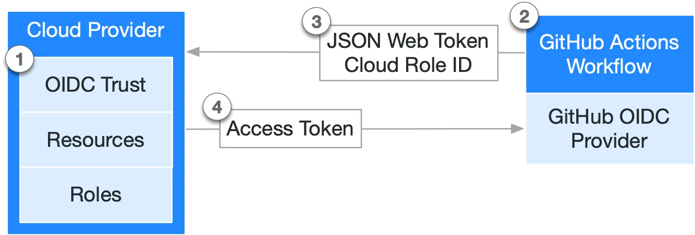
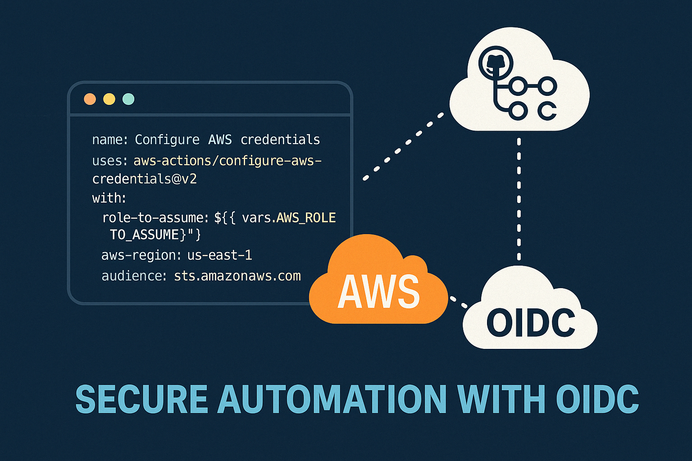

# Overview of OpenID Connect (OIDC)

GitHub Actions workflows are often designed to access a cloud provider (such as AWS, Azure, GCP, HashiCorp Vault, and others) in order to deploy software or use the cloud's services. Before the workflow can access these resources, it will supply credentials, such as a password or token, to the cloud provider. These credentials are usually stored as a secret in GitHub, and the workflow presents this secret to the cloud provider every time it runs.

However, using hardcoded secrets requires you to create credentials in the cloud provider and then duplicate them in GitHub as a secret

After you have established a trust connection with a cloud provider that supports OIDC, you can configure your workflow to request a short-lived access token directly from the cloud provider.


## Benefits of using OIDC

By updating your workflows to use OIDC tokens, you can adopt the following good security practices:

- No cloud secrets: You won't need to duplicate your cloud credentials as long-lived GitHub secrets. Instead, you can configure the OIDC trust on your cloud provider, and then update your workflows to request a short-lived access token from the cloud provider through OIDC.
- Authentication and authorization management: You have more granular control over how workflows can use credentials, using your cloud provider's authentication (authN) and authorization (authZ) tools to control access to cloud resources.
- Rotating credentials: With OIDC, your cloud provider issues a short-lived access token that is only valid for a single job, and then automatically expires.

## How OIDC integrates with GitHub Actions

The following diagram gives an overview of how GitHub's OIDC provider integrates with your workflows and cloud provider:



1. You establish an OIDC trust relationship in the cloud provider, allowing specific GitHub workflows to request cloud access tokens on behalf of a defined cloud role.
2. Every time your job runs, GitHub's OIDC provider auto-generates an OIDC token. This token contains multiple claims to establish a security-hardened and verifiable identity about the specific workflow that is trying to authenticate.
3. A step or action in the workflow job can request a token from GitHub’s OIDC provider, which can then be presented to the cloud provider as proof of the workflow’s identity.
4. Once the cloud provider successfully validates the claims presented in the token, it then provides a short-lived cloud access token that is available only for the duration of the job.

## Understanding the OIDC token

Each job requests an OIDC token from GitHub's OIDC provider, which responds with an automatically generated JSON web token (JWT) that is unique for each workflow job where it is generated. When the job runs, the OIDC token is presented to the cloud provider. To validate the token, the cloud provider checks if the OIDC token's subject and other claims are a match for the conditions that were preconfigured on the cloud role's OIDC trust definition.

The following example OIDC token uses a subject (`sub`) that references a job environment named prod in the `octo-org/octo-repo` repository.

```json
{
  "typ": "JWT",
  "alg": "RS256",
  "x5t": "example-thumbprint",
  "kid": "example-key-id"
}
{
  "jti": "example-id",
  "sub": "repo:octo-org/octo-repo:environment:prod",
  "environment": "prod",
  "aud": "https://github.com/octo-org",
  "ref": "refs/heads/main",
  "sha": "example-sha",
  "repository": "octo-org/octo-repo",
  "repository_owner": "octo-org",
  "actor_id": "12",
  "repository_visibility": "private",
  "repository_id": "74",
  "repository_owner_id": "65",
  "run_id": "example-run-id",
  "run_number": "10",
  "run_attempt": "2",
  "runner_environment": "github-hosted",
  "actor": "octocat",
  "workflow": "example-workflow",
  "head_ref": "",
  "base_ref": "",
  "event_name": "workflow_dispatch",
  "ref_type": "branch",
  "job_workflow_ref": "octo-org/octo-automation/.github/workflows/oidc.yml@refs/heads/main",
  "iss": "https://token.actions.githubusercontent.com",
  "nbf": 1632492967,
  "exp": 1632493867,
  "iat": 1632493567
}
```

[OpenID Connect](https://docs.github.com/en/actions/concepts/security/openid-connect)

### What OIDC Actually Is
- OIDC is an identity layer on top of OAuth 2.0.
- It defines a way to issue an ID token (usually a JWT) that represents an authenticated identity.
- That identity could be:
  - A human user logging into a web app.
  - A service principal, workload, or machine running in a CI/CD pipeline.


### The “old way”: Static tokens or long-lived credentials
Before OIDC, the common way to let GitHub Actions connect to AWS was:
- Store AWS Access Key + Secret Key as encrypted GitHub secrets.
- The workflow pulls those credentials and uses them to authenticate.
Problems with this approach:
  - Long-lived: Keys sit in GitHub until rotated. If leaked, they can be abused.
  - Manual rotation: You need to rotate keys, update secrets, and manage lifecycle.
  - Security risk: Anyone with repo access could exfiltrate the key and use it outside Actions.


  ### OpenID Connect (OIDC)
GitHub added support for federated identity via OIDC. Here’s how it works:
1. GitHub issues a short-lived OIDC token during the workflow run.
  - The token is cryptographically signed and contains claims like repo name, workflow, branch, etc.
  - Example: sub=repo:my-org/my-repo:ref:refs/heads/main
2. AWS trusts GitHub as an identity provider (IdP).
  - In AWS IAM, you configure a role with a trust policy that says:
“Allow anyone with a valid GitHub OIDC token from repo X and branch Y to assume this role.”
- GitHub workflow requests a cloud token.
  - The job exchanges its OIDC token for temporary AWS credentials (via STS `AssumeRoleWithWebIdentity`).
- AWS returns short-lived credentials valid only for that workflow run.


`https://token.actions.githubusercontent.com/.well-known/openid-configuration`

```json
{
    "issuer": "https://token.actions.githubusercontent.com",
    "jwks_uri": "https://token.actions.githubusercontent.com/.well-known/jwks",
    "subject_types_supported": [
        "public",
        "pairwise"
    ],
    "response_types_supported": [
        "id_token"
    ],
    "claims_supported": [
        "sub",
        "aud",
        "exp",
        "iat",
        "iss",
        "jti",
        "nbf",
        "ref",
        "sha",
        "repository",
        "repository_id",
        "repository_owner",
        "repository_owner_id",
        "enterprise",
        "enterprise_id",
        "run_id",
        "run_number",
        "run_attempt",
        "actor",
        "actor_id",
        "workflow",
        "workflow_ref",
        "workflow_sha",
        "head_ref",
        "base_ref",
        "event_name",
        "ref_type",
        "ref_protected",
        "environment",
        "environment_node_id",
        "job_workflow_ref",
        "job_workflow_sha",
        "repository_visibility",
        "runner_environment",
        "issuer_scope"
    ],
    "id_token_signing_alg_values_supported": [
        "RS256"
    ],
    "scopes_supported": [
        "openid"
    ]
}

```

- Go into `AWS IAM Console` and create a new `Identity Provider`. 
- Use Provider Type OpenID Connect , Provider URL `https://token.actions.githubusercontent.com` Audience `sts.amazonaws.com` and add any tags you want. Finish up by clicking Add Provider. Take note of the ARN of the created Provider.

[Trusting Pipeline Code in GitHub Actions in AWS and More](https://evernorthtech.medium.com/trusting-pipeline-code-in-github-actions-in-aws-and-more-44b66065536f)


[Securing CI/CD Pipelines with GitHub OIDC and AWS IAM](https://www.paulmduvall.com/securing-ci-cd-pipelines-with-github-oidc-and-aws-iam/)



## Setting Up OIDC Between GitHub Actions and AWS:

Create `trust-policy.json` file and add the below code to it.
```json
{
    "Version": "2012-10-17",
    "Statement": [
      {
        "Effect": "Allow",
        "Principal": {
          "Federated": "arn:aws:iam::$AWS_ACCOUNT_ID:oidc-provider/$OIDC_PROVIDER"
        },
        "Action": "sts:AssumeRoleWithWebIdentity",
        "Condition": {
          "StringLike": {
            "$OIDC_PROVIDER:sub": "repo:$GITHUB_ORG/$GITHUB_REPO:*"
          }
        }
      }
    ]
  }

```

Create `eks-policy.json` file and add the below code to it.

```json
{
    "Version": "2012-10-17",
    "Statement": [
      {
        "Effect": "Allow",
        "Action": [
          "eks:DescribeCluster",
          "eks:ListClusters"
        ],
        "Resource": "*"
      },
      {
        "Effect": "Allow",
        "Action": [
          "ecr:GetAuthorizationToken",
          "ecr:BatchCheckLayerAvailability",
          "ecr:GetDownloadUrlForLayer",
          "ecr:BatchGetImage",
          "ecr:InitiateLayerUpload",
          "ecr:UploadLayerPart",
          "ecr:CompleteLayerUpload",
          "ecr:PutImage"
        ],
        "Resource": "*"
      }
    ]
  }
  ```

  Now, run the following commands to set up the environment variables.

```sh
export OIDC_PROVIDER=”token.actions.githubusercontent.com”
export AWS_ACCOUNT_ID=$(aws sts get-caller-identity — query “Account” — output text)
export GITHUB_ORG=<github-org-name>
export GITHUB_REPO=<github-repo-name>
```
Run the below command to create the OIDC IAM provider.

```sh
aws iam create-open-id-connect-provider \
--url https://$OIDC_PROVIDER \
--client-id-list sts.amazonaws.com \
--thumbprint-list "6938fd4d98bab03faadb97b34396831e3780aea1"
```

Run the below command to create an IAM Role for GitHub Actions.

```sh
aws iam create-role \
 --role-name GitHubActionsEKSDeployRole \
--assume-role-policy-document file://trust-policy.json
```

Run the below command to create an IAM policy for the GitHub Action role.
```sh
aws iam create-policy \
--policy-name GitHubActionsEKSPolicy \
--policy-document file://eks-policy.json

```

Run the below command to attach an IAM policy to the role.

```sh
aws iam attach-role-policy \
--role-name GitHubActionsEKSDeployRole \
--policy-arn arn:aws:iam::$AWS_ACCOUNT_ID:policy/GitHubActionsEKSPolicy
```


[setting-oidc-for-github-actions-workflows-with-aws-using-terraform-](https://blog.stackademic.com/setting-oidc-for-github-actions-workflows-with-aws-using-terraform-81bc146e4128)


[deploy-without-credentials-using-oidc-and-github-actions](https://blog.alexellis.io/deploy-without-credentials-using-oidc-and-github-actions/)


[how-to-deploy-terraform-to-aws-with-github-actions-authenticated-with-openid-connect](https://xebia.com/blog/how-to-deploy-terraform-to-aws-with-github-actions-authenticated-with-openid-connect/)


[github-actions-oidc-reusable-workflows](https://josh-ops.com/posts/github-actions-oidc-reusable-workflows/)


[Secure Your CI/CD: GitHub Actions Workflows with OIDC for AWS and GCP](https://blog.realkinetic.com/secure-your-ci-cd-github-actions-workflows-with-oidc-for-aws-and-gcp-12efe44d3e89)

[Configuring OpenID Connect in cloud providers](https://docs.github.com/en/actions/how-tos/secure-your-work/security-harden-deployments/oidc-in-cloud-providers)

[Configuring OpenID Connect in Amazon Web Services](https://docs.github.com/en/enterprise-server@3.17/actions/how-tos/secure-your-work/security-harden-deployments/oidc-in-aws)

[OpenID Connect reference](https://docs.github.com/en/enterprise-cloud@latest/actions/reference/security/oidc)

[Trusting Pipeline Code in GitHub Actions in AWS and More](https://evernorthtech.medium.com/trusting-pipeline-code-in-github-actions-in-aws-and-more-44b66065536f)

[Securely Connect GitHub Actions to AWS Using IAM Roles and OIDC ](https://dev.to/aws-builders/securely-connect-github-actions-to-aws-using-iam-roles-and-oidc-4ek2)


[oidc-for-github-actions-on-aws](https://scalesec.com/blog/oidc-for-github-actions-on-aws/)

[secure-aws-deploys-from-github-actions-with-oidc](https://www.eliasbrange.dev/posts/secure-aws-deploys-from-github-actions-with-oidc/)

[aws-gh-actions](https://5pi.de/2024/aws-gh-actions/)